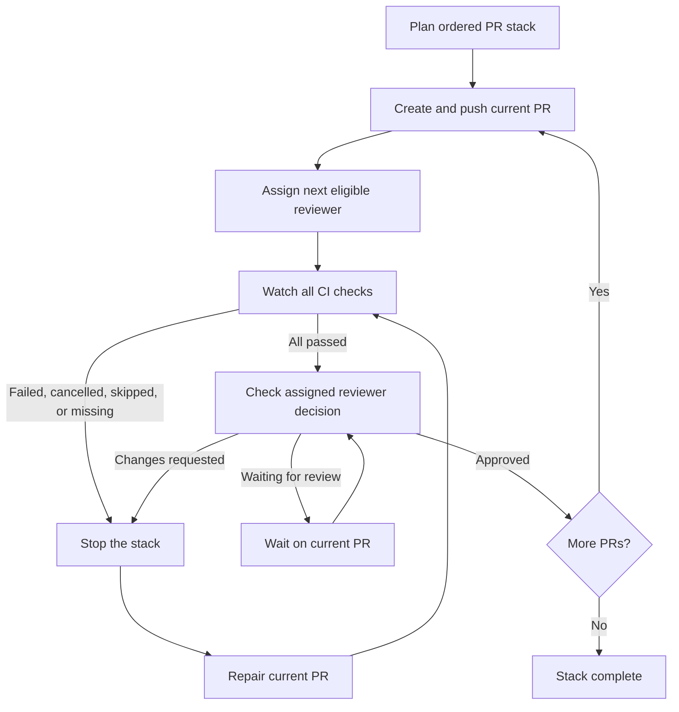

# PR Stack Review

This Claude Code suite publishes a dependency-ordered PR stack, rotates one reviewer per PR from a configured group, and advances only after the current PR passes CI and receives approval.

## Flow



A failed gate blocks the stack at the current PR. Keep that PR open, repair it in place, rerun CI, address reviewer feedback, and wait for approval. Do not recreate the stack to clear a failure: that loses review context and creates replacement URLs and notifications. See the [passing and blocked walkthrough](examples/stack-run-walkthrough.md), or run its local simulator:

```bash
python3 suites/pr-stack-review/examples/run_stack_demo.py pass
python3 suites/pr-stack-review/examples/run_stack_demo.py blocked
```

The simulator uses fixed sample data. It makes no GitHub calls and does not create branches, PRs, or CI runs.

## Responsibilities

| Component | Responsibility |
|---|---|
| Claude skill | Plans the stack, creates one PR at a time, evaluates gates, and stops progression |
| Reviewer helper | Selects one eligible reviewer and advances the machine-local round-robin cursor after GitHub confirms assignment |
| GitHub Actions or other CI | Runs the repository pipeline and reports check results to GitHub |
| Active Claude Code session | Polls GitHub check and review state through `gh`; there is no detached monitor in this suite |
| Assigned reviewer | Reviews the current PR, asks questions or requests changes, then approves when satisfied |
| Developer | Resolves pipeline failures and review feedback on the blocked PR |

## Gate conditions

A PR advances the stack only when:

1. At least one CI check is reported.
2. Every reported check passes.
3. The assigned reviewer's latest decisive review is `APPROVED`.
4. Any reviewer question or requested change has been answered or addressed.

The stack stops for failed, cancelled, skipped, pending-after-watch, or missing checks; GitHub API errors; and `CHANGES_REQUESTED`. A pending review holds the current PR without creating the next one. The skill answers reviewer questions with evidence from the diff and tests, and acknowledges uncertainty. It does not ask the reviewer to justify approval or treat its own answer as approval.

## GitHub capabilities and enterprise preflight

The full workflow needs a repository and an authenticated GitHub CLI connection that can perform these operations. Fine-grained token permissions below are the GitHub REST API permission names; a GitHub App installation or enterprise policy may grant access differently.

| Capability | Needed for | If unavailable |
|---|---|---|
| Repository metadata and contents: read | Identify the repo, default branch, and source files | Stop before planning against an unverified base |
| Contents: write, plus Git push access | Create/push feature branches and commits | Stop before publishing; do not try to bypass branch rules |
| Pull requests: read/write | Open draft PRs, request a reviewer, inspect reviews and comments, and reply to inline review comments | Stop the stack at the current PR; report which operation was denied |
| Checks: read | Read check-run results | Treat the gate as unknown and do not create the next PR |
| Commit statuses: read | Read legacy status contexts when the CI provider reports statuses instead of check runs | Treat missing/unreadable results as blocked |
| Actions: read (optional) | Open workflow run details or logs while diagnosing a failed check | The check can still block progression; diagnosis may require a permitted CI link or a maintainer |

The skill does not need permission to merge PRs, change branch protection, administer the repository, or modify GitHub Actions. A persistent background monitor is a separate future capability: it would need an approved shared controller or workflow and its own security review.

Before the first write, verify the GitHub host and authenticated account, repository access, configured reviewer usernames, and whether the repository reports CI checks. Write access and organization policy can only be fully confirmed when GitHub accepts the first branch/PR operation. If a required operation returns an authorization, policy, or API error, stop and report it; do not downgrade the gate or switch credentials on the user's behalf.

Enterprise installations may restrict fine-grained or classic personal access tokens, require organization approval or SSO authorization, limit installed GitHub Apps, disallow specific Actions, or enforce branch naming/protection rules. Use the enterprise-approved credential and host. If the GitHub CLI/API endpoint or feature is disabled, the skill can still produce a stack plan, but it cannot publish or safely gate that stack.

See GitHub's current documentation for [pull request permissions](https://docs.github.com/en/rest/pulls/pulls), [check run permissions](https://docs.github.com/en/rest/checks/runs), [review comment permissions](https://docs.github.com/en/rest/pulls/comments), and [enterprise personal access token policies](https://docs.github.com/en/enterprise-cloud@latest/admin/enforcing-policies/enforcing-policies-for-your-enterprise/enforcing-policies-for-personal-access-tokens-in-your-enterprise).

## Monitoring boundary

Monitoring runs inside the active Claude Code session through `gh pr checks` and `gh pr view`. GitHub Actions (or another configured CI provider) runs the pipeline; this skill observes the results and enforces the stop/advance decision. Closing or losing the session pauses monitoring. When resuming, reread the current PR's latest checks, review decision, comments, and base/head before continuing. Continuous monitoring across sessions requires a GitHub Actions workflow or another shared controller.

Reviewer rotation state is stored on the machine running Claude. Several developers or runners need a shared ledger before the rotation can provide team-wide ordering.

## Reviewer configuration

Create `.claude/pr-stack-reviewers.json` in the repository that will use the skill:

```json
{
  "groups": {
    "rtc-reviewers": [
      "reviewer-one",
      "reviewer-two",
      "reviewer-three"
    ]
  }
}
```

Replace the sample names with GitHub usernames. The helper excludes the PR author and anyone already requested on that PR.
