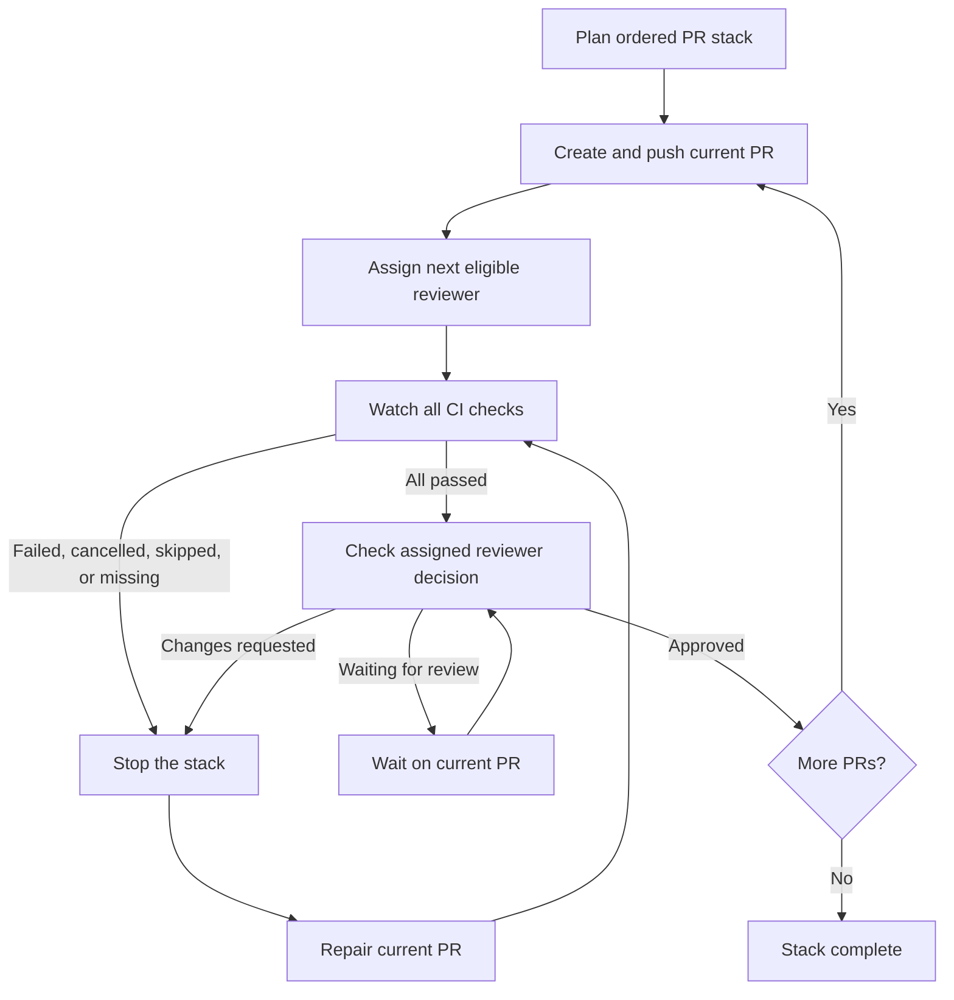

# PR Stack Review

This Claude Code suite publishes a dependency-ordered PR stack, rotates one reviewer per PR from a configured group, and advances only after the current PR passes CI and receives approval.

## Flow



The failed PR remains open with its discussion and checks. Repair that PR, update any published descendants from their parent if needed, rerun CI, and request re-review. Recreating the stack would discard useful review context and generate replacement URLs and notifications.

## Responsibilities

| Component | Responsibility |
|---|---|
| Claude skill | Plans the stack, creates one PR at a time, evaluates gates, and stops progression |
| Reviewer helper | Selects one eligible reviewer and advances the machine-local round-robin cursor after GitHub confirms assignment |
| GitHub Actions or other CI | Runs the repository pipeline and reports check results to GitHub |
| Assigned reviewer | Approves the current PR or requests changes |
| Developer | Resolves pipeline failures and review feedback on the blocked PR |

## Gate conditions

A PR advances the stack only when:

1. At least one CI check is reported.
2. Every reported check passes.
3. The assigned reviewer's latest decisive review is `APPROVED`.

The stack stops for failed, cancelled, skipped, pending-after-watch, or missing checks; GitHub API errors; and `CHANGES_REQUESTED`. A pending review holds the current PR without creating the next one.

## Monitoring boundary

Monitoring is performed by the active Claude Code session through `gh pr checks` and `gh pr view`. Closing that session stops monitoring. Continuous monitoring across sessions requires a GitHub Actions workflow or another shared controller.

Reviewer rotation state is stored on the machine running Claude. Several developers or runners need a shared ledger before the rotation can provide team-wide ordering.

## Reviewer configuration

Create `.claude/pr-stack-reviewers.json` in the repository that will use the skill:

```json
{
  "groups": {
    "rtc-reviewers": [
      "reviewer-one",
      "reviewer-two",
      "reviewer-three"
    ]
  }
}
```

Replace the sample names with GitHub usernames. The helper excludes the PR author and anyone already requested on that PR.
