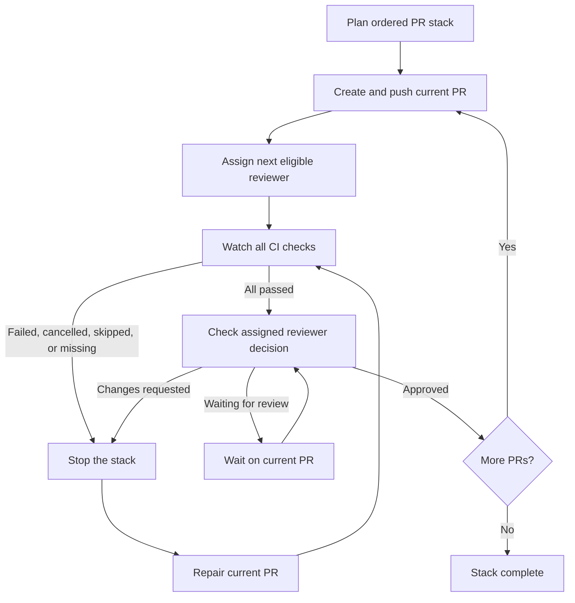

# PR Stack Review

This Claude Code suite publishes a dependency-ordered PR stack, rotates one reviewer per PR from a configured group, and advances only after the current PR passes CI and receives approval.

## Flow



A failed gate blocks the stack at the current PR. Keep that PR open, repair it in place, rerun CI, address reviewer feedback, and wait for approval. Do not recreate the stack to clear a failure: that loses review context and creates replacement URLs and notifications. See the [simulated passing and failing walkthrough](examples/stack-run-walkthrough.md).

## Responsibilities

| Component | Responsibility |
|---|---|
| Claude skill | Plans the stack, creates one PR at a time, evaluates gates, and stops progression |
| Reviewer helper | Selects one eligible reviewer and advances the machine-local round-robin cursor after GitHub confirms assignment |
| GitHub Actions or other CI | Runs the repository pipeline and reports check results to GitHub |
| Active Claude Code session | Polls GitHub check and review state through `gh`; there is no detached monitor in this suite |
| Assigned reviewer | Reviews the current PR, asks questions or requests changes, then approves when satisfied |
| Developer | Resolves pipeline failures and review feedback on the blocked PR |

## Gate conditions

A PR advances the stack only when:

1. At least one CI check is reported.
2. Every reported check passes.
3. The assigned reviewer's latest decisive review is `APPROVED`.
4. Any reviewer question or requested change has been answered or addressed.

The stack stops for failed, cancelled, skipped, pending-after-watch, or missing checks; GitHub API errors; and `CHANGES_REQUESTED`. A pending review holds the current PR without creating the next one. The skill answers reviewer questions with evidence from the diff and tests, and acknowledges uncertainty. It does not ask the reviewer to justify approval or treat its own answer as approval.

## Monitoring boundary

Monitoring runs inside the active Claude Code session through `gh pr checks` and `gh pr view`. GitHub Actions (or another configured CI provider) runs the pipeline; this skill observes the results and enforces the stop/advance decision. Closing or losing the session pauses monitoring. When resuming, reread the current PR's latest checks, review decision, comments, and base/head before continuing. Continuous monitoring across sessions requires a GitHub Actions workflow or another shared controller.

Reviewer rotation state is stored on the machine running Claude. Several developers or runners need a shared ledger before the rotation can provide team-wide ordering.

## Reviewer configuration

Create `.claude/pr-stack-reviewers.json` in the repository that will use the skill:

```json
{
  "groups": {
    "rtc-reviewers": [
      "reviewer-one",
      "reviewer-two",
      "reviewer-three"
    ]
  }
}
```

Replace the sample names with GitHub usernames. The helper excludes the PR author and anyone already requested on that PR.
